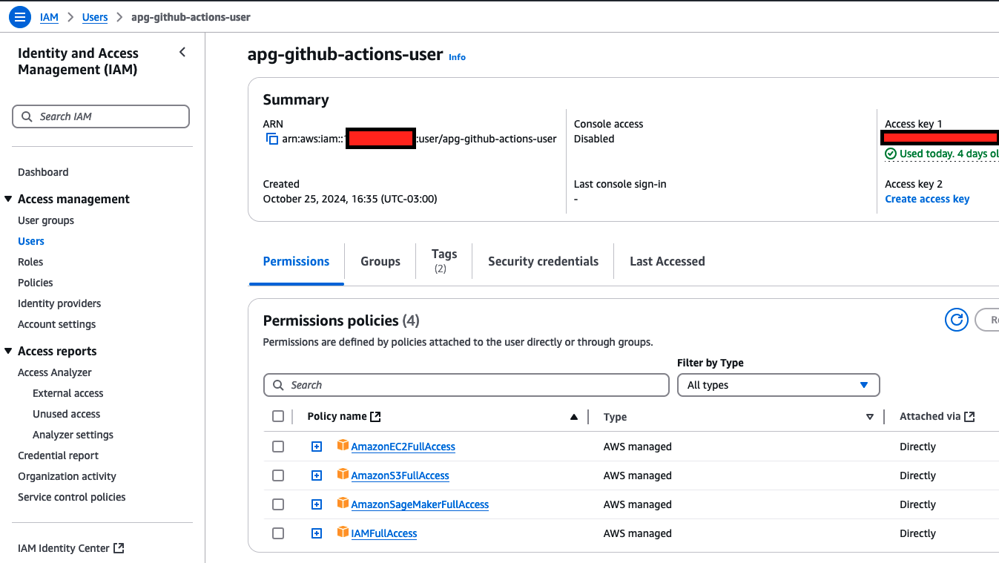
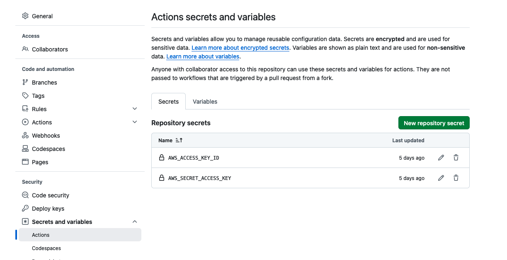
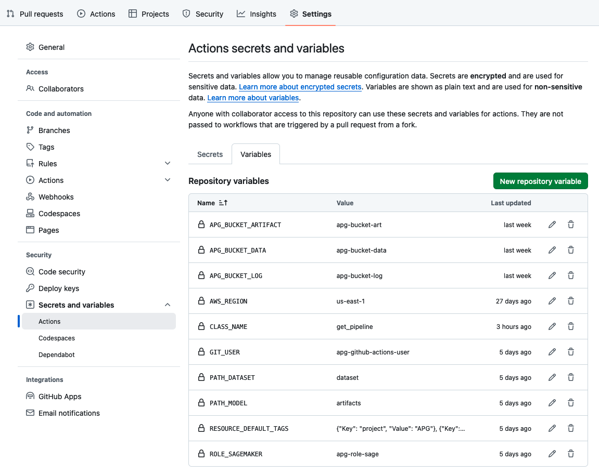

# APG - Open Machine Learning Operations

Alpha version. 0.5

The main objective of this repository is to serve as a study tool to experiment the deployment of AI/ML models in a non-production environment, using the concept of MLOPs, and as many open components, free-tier services, and low-cost services as possible. Other goals of this repository it is to provide a set of artifacts that can leverage MLOps as part of the any AI/ML Use case. This includes:

- MLOps/Data Science folder structure
- Terraform templates
- Python scripts to build and deploy a model
- Python scripts to create a sagemaker pipeline
- GitOps templates and configurations for deploying

This repository contains reusable artifacts and templates to support the Machine Learning Operations (MLOps), also, Terraform and Git Actions CI/CD are used to deploy and orchestrate MLOps workflow on Amazon SageMaker platform. 

In this example, we will automate a model-build pipeline that includes steps for data preparation, model training, model evaluation, and registration of that model in the SageMaker Model Registry. The resulting trained ML model is deployed from the model registry to staging and production environments upon the approval.

> **_NOTE:_** Although one of the goals of this repository is to create a template to accelerate the deployment of AI/ML models, it is NOT yet ready for PRODUCTION use. DO NOT USE it for a production environment.  

Thank you for reading and make a good usage of this repo. :grinning:	

## Project Organization
------------

    ├── LICENSE
    ├── Makefile                <- Makefile with commands like `make train`
    ├── README.md               <- The top-level README for developers using this project.
    ├── .github
    │   └── workflows           <- Git Actions to execute the CI/CD pipeline
    │
    ├── data
    │   ├── external            <- Data from third party sources.
    │   └── raw                 <- The original, immutable data dump.
    │
    ├── docs                    <- Data dictionaries, manuals, and all other explanatory materials.
    │
    ├── docker                  <- Docker files
    │
    ├── artifacts               <- Trained and serialized models, model predictions, or model summaries
    │
    ├── notebooks               <- Jupyter notebooks using in the Exploratory phase.
    │    
    ├── reports                 <- Generated analysis as HTML, PDF, LaTeX, etc.
    │   └── figures             <- Generated graphics and figures to be used in reporting
    │
    ├── requirements.txt        <- The requirements file for reproducing the analysis environment, e.g.
    │                               generated with `pip freeze > requirements.txt`
    │
    ├── setup.py                <- makes project pip installable (pip install -e .) so src can be imported
    ├── src                     <- Source code for use in this project.
    │   ├── __init__.py         <- Makes src a Python module
    │   ├── main.py             <- Entry point to select program modules to be executed
    │   │
    │   ├── pipeline            <- Scripts to generate and run the Sagemaker Pipeline
    │   │   └── create_pipeline.py
    │   │   └── run_pipeline.py   
    │   │
    │   ├── models              <- Scripts to assemble the model pipeline and create all nededded processes 
    │   │   |                       to generate a model: feature engineering, train, register and deploy model 
    │   │   │                 
    │   │   ├── deploy.py
    │   │   ├── evaluate.py
    │   │   ├── features.py
    │   │   ├── pipeline.py
    │   │   ├── predict.py
    │   │   ├── preprocess.py
    │   │   └── train.py
    │   │
    │   └── visualization       <- Scripts to create exploratory and results oriented visualizations
    │       └── visualize.py
    │
    ├── terraform               <- IaC to set up AWS infrastructure
    │   └── suser               <- IaC to set up User to run the CI/CD pipeline
    │
    └── tox.ini                 <- tox file with settings for running tox; see tox.readthedocs.io


## Installation
------------

_Below is an example of how you can you installing and setting up your project._

Clone the repo
   ```sh
   git clone https://github.com/ruanroloff/apg-open-mlops.git
   ```


To install the project, please run the following commands:

```
$ python -m venv env
$ source env/bin/activate
$ make requirements
```

All the available command-line utilities can be found executing the command:

```
$ make help
```

---
## Table of Contents

- [APG - Open Machine Learning Operations](#apg---open-machine-learning-operations)
  - [Table of Contents](#table-of-contents)
  - [Project Organization](#project-organization)
  - [Overview](#overview)
  - [Prerequisites](#prerequisites)
  - [Roles and Permissions](#roles-and-permissions)
  - [Instruction](#instruction)
  - [Multi-account, team, and project configuration](#multi-account-team-and-project-configuration)
  - [Model deployment](#model-deployment)
  - [Model inference](#model-inference)
  - [Model monitor](#model-monitor)
  - [Cleanup](#cleanup)
  - [Appendixes](#appendixes)
  - [Reference](#references)
  - [Contacts](#contacts)
  - [Roadmap (Future Backlog)](#roadmap)

---
## Overview

**Use Case**

This architecture describes using machine learning (ML) for the automated identification of heart disease. One of the major tasks on this dataset is to predict based on the given attributes of a patient that whether that particular person has heart disease or not and other is the experimental task to diagnose and find out various insights from this dataset which could help in understanding the problem more.

The dataset used in this observation is [Heart Disease](https://archive.ics.uci.edu/dataset/45/heart+disease) (Donated on 6/30/1988). This dataset includes 76 attributes, but all published studies relate to the use of a subset of 14 of them. The Cleveland database is the only one used by ML researchers to date.

The 'target' column 'num' in the dataset represents the:

- 0: No heart disease (absence of disease).
- 1-4: Presence of heart disease, with varying severity.
  - 1: Mild heart disease.
  - 2: Moderate heart disease.
  - 3: Severe heart disease.
  - 4: Critical heart disease

> **_NOTE:_** Remember, the objective of this project is to analyze the MLOps process as a whole. The Use case selected here is only to illustrate machine learning techniques and metrics, and the dataset problem will not be researched in depth in this project, so, there may be flaws in the techniques used in the analysis of the dataset, as well as arbitrary weighting and others.

**Solution Architecture**

... not ready yet

---
## Prerequisites

Before you begin, make sure you have the following command line tools installed:

- git
- Python 3.9 or above
- terraform 1.5.0 or above
- AWS CLI 2.3.1 or above

The following steps need to be complete before creating GitHub projects. 
1. Install [Git](https://github.com/git-guides/install-git). 
Create the [Github repository](https://docs.github.com/en/repositories/creating-and-managing-repositories/quickstart-for-repositories) in Github.com, set up [Secrets and variables](https://docs.github.com/en/actions/security-for-github-actions/security-guides/using-secrets-in-github-actions), and then clone the repo. 
2. Create an IAM user for Github. This user will be used by GitActions Pipelines when interacting with SageMaker APIs. Take note of the AWS Access Key and Secret Key. This will be used in subsequent steps.
3. [Python](https://docs.python.org/3/using/index.html)
4. [Terraform CLI installed](https://learn.hashicorp.com/tutorials/terraform/install-cli)
5. [AWS CLI installed](https://docs.aws.amazon.com/cli/latest/userguide/install-cliv2.html)

and of course, a AWS Account (new account) - [Create an AWS account](https://docs.aws.amazon.com/accounts/latest/reference/manage-acct-creating.html)

---
## Roles and Permissions

When generating credentials, we recommend that you grant the minimum permissions possible. 
Recomendation: Instead of using personal credentials, use deploy keys or a service account.
While we recommend this, we are not doing it here. :see_no_evil:

Step 1: Create an user for Git actions in an AWS account
  This user will be used by git actions to run the pipelines

  To create a user:
  1. Sign in to the AWS Management Console and open the IAM console at https://console.aws.amazon.com/iam/.
  2. In the navigation pane, choose Users, and then choose Add user.
  3. In the User name box, enter a user name. -> We are using by default: apg-github-actions-user
  4. Click Next: Permissions. Choose "Attach policies directly"
    - AmazonEC2FullAccess
    - AmazonS3FullAccess
    - AmazonSageMakerFullAccess
    - IAMFullAccess
  5. Click Next: Review and create
  6. Click Create user

  

Step 2: Create access keys
  This access keys will be used as AWS_ACCESS_KEY_ID and AWS_SECRET_ACCESS_KEY.

  To create access key
  1. Open the AWS Management Console
  2. Go to: IAM> Access Management > Users > apg-github-actions-user (IAM > Users > apg-github-actions-user)
  3. Choose Security Credentials.
  4. In the Access keys section, choose Create access key. 
  5. To continue, select the use case (Other), and then choose Next and Create access key.
  6. On the Retrieve access key page, your Access key ID is displayed.
  7. Under Secret access key, choose Show and then copy the access key ID and secret key from your browser window and paste it somewhere secure.   

---
## Instruction

**GitActions - Automatically**

Step 1: Set Git actions parameters
 First, it is needed to set the SECRETS and INFORMATION VARIABLES in github


- **SECRETS**
  
  To create secrets or variables on GitHub for a personal account repository, you must be the repository owner. 

  On GitHub, navigate to the main page of the repository. Under your repository name, click Settings. 
  1. In the "Security" section of the sidebar, select  Secrets and variables, then click Actions.
  2. Click the Secrets tab.
  3. Click New repository secret.
    - Add Name field
    - Add Secret field
  4. Click Add secret.

  **These are the secrets that need to be added**
  - AWS_ACCESS_KEY_ID
  - AWS_SECRET_ACCESS_KEY

  


- **INFORMATION VARIABLES**
  
  Variables provide a way to store and reuse non-sensitive configuration information. 
  
  1. In the "Security" section of the sidebar, select  Secrets and variables, then click Actions.
  2. New repository variable.
    - Add Name field
    - Add Value field
  3. Click Add variable.

  **These are the variables that need to be added**
  - APG_BUCKET_ARTIFACT
  - APG_BUCKET_DATA
  - APG_BUCKET_LOG
  - AWS_REGION
  - CLASS_NAME
  - GIT_USER
  - PATH_DATASET
  - PATH_MODEL
  - RESOURCE_DEFAULT_TAGS
  - ROLE_SAGEMAKER

  


Step 2: Run Git actions workflow

 To run the complete MLOps pipeline, simply commit the code to the main branch, or check the available pipelines (workflows) in the actions tab, and select "APG - Pipeline - Open MLOps". 
 
 For more information, please, visit the Github official documentation: https://docs.github.com/en/actions/managing-workflow-runs-and-deployments/managing-workflow-runs/manually-running-a-workflow


**Local - Manually**

Step 1: Configuring environment variables for the [AWS CLI](https://docs.aws.amazon.com/cli/v1/userguide/cli-configure-envvars.html)

Linux or macOS
```bash
export AWS_ACCESS_KEY_ID=???
export AWS_SECRET_ACCESS_KEY=???
export AWS_DEFAULT_REGION=us-east-1
```
*replace ??? with your variables

Step 2: Check if account is correctly set up

```bash
aws iam get-user
```

Step 3: Create AWS infrastructure by Run Terraform code

Go to `Terraform files`  folder,  run the following commands in Terminal:  
`terraform init`  
`terraform apply`  

Step 4: Copy heart dataset to AWS account s3

```bash
cd ../project/datasetfolder/
aws s3 cp heart_disease_uci.csv s3://my-bucket/heart/heart_disease_uci.csv
```

*replace '../project/datasetfolder/' with your folder; 
**replace 'my-bucket' with your bucket; 
***replace '????????????'with your AWS Account;

Step 4: Execute the Python program through command line

```bash
cd ../project/src/

python3 main.py -n 'models.pipeline' -c 'create_pipeline' -role-arn 'arn:aws:iam::????????????:role/apg-role-sage' -description 'test description' -tags '[{"Key": "keytest", "Value": "mlops"}]' -kwargs '{"region" : "us-east-1", "role" : "arn:aws:iam::????????????:role/apg-role-sage", "inputdata" : "s3://my-bucket/data/heart_disease_uci.csv", "modelpath" : "s3://my-bucket/artifacts/apg-heart-model", "logpath" : "s3://my-bucket"}'
```

*replace '../project/datasetfolder/' with your folder; 
**replace 'my-bucket' with your bucket; 
***replace '????????????'with your AWS Account;

---
## Multi-account, team, and project configuration
[New Feature] 

In this version, there is still no option to automate deployment across multiple environments. :neutral_face:	


---
## Model deployment
[Under Development]

The automated deployment of the pipeline has not yet been built. To do this, use the notebook: [notebook -> note_deploy.ipynb](/notebooks/note_deploy.ipynb) as an example to deploy the model in a non-production environment and perform the tests.

---
## Model inference
[Under Development]

Jobs for inference have not yet been developed, however, together with the deploy notebook, there is an inference option using the webservice of the manually published model. Some options for using the model are:
- Extract the "model.tar.gz" and use xgboost.XGBClassifier to load the model;
- Use note_deploy to deploy the model and boto3.client('sagemaker-runtime') to make the inference;

---
## Model monitor
[New Feature] 

Not yet developed

---
## Cleanup
[Under Development]

Automation clenaup is not developed (not working), mainly due to the generation of artifacts in sagemaker and data in s3... or because we didn't have time :sweat_smile:	

There is a draft to assist with removal: .github>workflows>delete.yml (it can help).

You can try manually:
1. Log into your AWS Account, delete the endpoints, the model, the domain and the files from the S3 bucket.
2. Go to `Terraform files`  folder,  run the following commands in Terminal:  
`terraform destroy`  

---
## Appendixes

**About Dataset**

**Context**

This is a multivariate type of dataset which means providing or involving a variety of separate mathematical or statistical variables, multivariate numerical data analysis. It is composed of 14 attributes which are age, sex, chest pain type, resting blood pressure, serum cholesterol, fasting blood sugar, resting electrocardiographic results, maximum heart rate achieved, exercise-induced angina, oldpeak. The Cleveland database is the only one used by ML researchers to date. One of the major tasks on this dataset is to predict based on the given attributes of a patient that whether that particular person has heart disease or not.

**Content**

**Column Descriptions:**

1. `id` (Unique id for each patient)
2. `age` (Age of the patient in years)
3. `origin` (place of study)
4. `sex` (Male/Female)
5. `cp` chest pain type ([typical angina, atypical angina, non-anginal, asymptomatic])
6. `trestbps` resting blood pressure (resting blood pressure (in mm Hg on admission to the hospital))
7. `chol` (serum cholesterol in mg/dl)
8. `fbs` (if fasting blood sugar > 120 mg/dl)
9. `restecg` (resting electrocardiographic results)
-- Values: [normal, stt abnormality, lv hypertrophy]
10. `thalach`: maximum heart rate achieved
11. `exang`: exercise-induced angina (True/ False)
12. `oldpeak`: ST depression induced by exercise relative to rest
13. `slope`: the slope of the peak exercise ST segment
14. `ca`: number of major vessels (0-3) colored by fluoroscopy
15. `thal`: [normal; fixed defect; reversible defect]
16. `num`: the predicted attribute

**Acknowledgements**

**Citation Request:**

The authors of the databases have requested that any publications resulting from the use of the data include the names of the principal investigator responsible for the data collection at each institution. They would be:

Hungarian Institute of Cardiology. Budapest: Andras Janosi, M.D.

University Hospital, Zurich, Switzerland: William Steinbrunn, M.D.

University Hospital, Basel, Switzerland: Matthias Pfisterer, M.D.

V.A. Medical Center, Long Beach and Cleveland Clinic Foundation:Robert Detrano, M.D., Ph.D.

**More information:**

Please, visit: 
https://www.kaggle.com/datasets/redwankarimsony/heart-disease-data


---
## References

This project used as a reference for the solution to diagnose heart diseases, the code produced by Hamza Pervez (profile on kaggle: https://www.kaggle.com/hamza062), which is published in the notebook: https://www.kaggle.com/code/hamza062/heart-disease-ann-hyperparameter-tuning-codanics .

This project used as base code the code produced in AWS Samples called aws-mlops-pipelines-terraform (https://github.com/aws-samples/aws-mlops-pipelines-terraform)


---
## Contacts
If you have any comments or questions, please contact:

The team who created the repo:

- Ruan Roloff <rroloff@amazon.com> 

---
## Roadmap

Future Backlog 

Requirements for the project to move from beta to become an accelerator to be used in a real environment:
- [ ] improve security
- [ ] fix docker images
- [ ] fix bugs and warnings in the code
- [ ] transform terraform into modules
- [ ] full parameterization (code)

New features enhancement:
- [x] model version register
- [ ] multi-account deployment
- [ ] model monitor setup
- [ ] model approval option
- [ ] mlflow integration 
- [ ] automated tests (tox.ini)
- [ ] transform project in seedcode and adapt code to service catalog

---

Copyright Amazon.com, Inc. or its affiliates. All Rights Reserved.
SPDX-License-Identifier: MIT-0